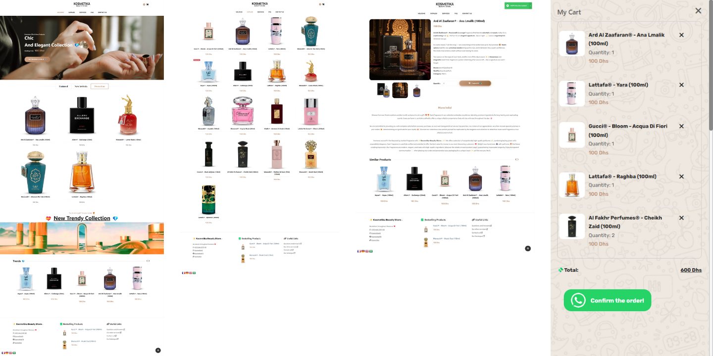

# ✨ Kosmetika Beauty Store

**Kosmetika Beauty Store** is a modern, responsive e-commerce web application for beauty products, built from scratch with HTML, JavaScript, Firebase, and the latest security best practices (including Firebase App Check).  
The project demonstrates clean code, secure data handling, and production-ready architecture for a real-world e-commerce scenario.

<!--  -->

> ### **Quick Start, No Setup Required**
>
> This application is designed to be instantly _“clone-and-play”_.  
> All core features work out-of-the-box, no Firebase or reCAPTCHA config needed for a first exploration.  
> Products and shop data are managed in a global JSON array, order and cart state are safely handled via `localStorage`, and checkout is as simple as sending a WhatsApp message (pre-filled invoice) using the WhatsApp API and query string.
>
> ⚡ **Just** `git clone` **the repo and open** `index.html` **in your browser to see the app in action!**
>
> _If you want to unlock the full, production-ready power, realtime analytics, App Check (reCAPTCHA) protection, and live stats via Firebase: just follow the config steps. But if you only need a quick demo, or want to skip advanced integrations, it’s ready for you out of the box!_

---

## ⭐ Why this project?

I didn't start from a stack. I started from a shop: **17 perfume references**, a catalogue that
changes a few times a year, and customers who already place their orders on WhatsApp. Every
decision below comes from taking that brief literally instead of reaching for the default
e-commerce architecture — and the most interesting engineering here is **what I chose not to build**.

**No backend. No database.** Seventeen products, with their name, description, price and photos
changing a handful of times a year, is not a database problem — it's a data file. The catalogue
lives in `app/data/products.js`, the photos in a static folder. Putting a REST API and a database
in front of 17 objects would have bought me a server to provision, patch, monitor, back up and pay
for, in exchange for nothing a `const` array doesn't already do.

**Product pages without a router.** Each card links to `product-details.html?productId=16`. The page
reads the query string, looks the product up in the catalogue, and hydrates itself. Same result as
server-side routing and templating — deep-linkable, shareable, one page per product — with no server
in the path.

**Security by subtraction.** No server, no database, no accounts, no sessions, no admin panel means
no SQL injection, no credential leak, no login to brute-force, no midnight CVE patching. Everything
runs in the visitor's own browser. The single writable surface left is one Firestore counter, locked
down by strict rules and App Check. You can't exploit what doesn't exist.

**Checkout where the customer already is.** The cart lives in `localStorage`; checkout formats the
order into a clean invoice and hands it to WhatsApp as a deep link. No payment gateway, no PCI scope,
no sign-up wall to abandon — the order lands in the conversation the shop already answers every day.
The most business-critical feature of the site is also the one with the least code behind it.

**Firebase is optional, deliberately.** It does one job: counting orders per product
(`total_orders`, `total_quantity`). One isolated module, two integer fields. The day it stops paying
for itself, removing it is a single commit and the shop keeps selling.

**What that trade buys:** €0 hosting on GitHub Pages, no infrastructure, no ops, no runtime bill, no
build step — `git push` _is_ the deployment. A visitor gets a fully static site: 85 KB of CSS and
52 KB of application JavaScript, after a cleanup pass that cut the inherited theme by 83 %.

This is a deliberate trade, not a shortcut, so I'll name its limits: past roughly a hundred products
the catalogue wants pagination and a real index, and card payments or live stock would genuinely
require a backend. Until then, adding one would be paying rent on complexity the business doesn't have.

---

## 🤝 Contributing

Pull requests, issues, and suggestions are always welcome.

---

## 🚀 Features

- 🔒 **Firebase App Check** (reCAPTCHA v3, debug support)
- 🛡️ **Secure by Design**: Strict Firestore rules (type checks, anti-tampering), no secrets on frontend
- 📦 **Firestore Cloud Sync**: Store products, orders, and analytics by product ID
- 🛒 **Product Catalog & Orders**
  - Add/remove products
  - Live stock, quantity selector, dynamic cart
- 💬 **WhatsApp Checkout**
  - One-click order confirmation
  - Pre-filled WhatsApp message with order details
- 📊 **Live Analytics**
  - Firestore updates:
    - `total_orders` (per product)
    - `total_quantity` (per product)
- 🌍 **i18n/Internationalization**: GTranslate instant language switch
- 🎉 **Modern UI/UX**
  - Responsive, smooth animations, mobile-first
  - Product carousel (Owl Carousel)
  - Image zoom (elevateZoom)
  - Beautiful notifications (Notyf)
  - FontAwesome icons
- ⚡ **Instant Feedback & Error Handling**
  - User-friendly popups and alerts
  - Validations client & server side
- 🧩 **Modular & Scalable**
  - Clean code split into modules
  - Ready for features: authentication, payment, advanced analytics, etc.

---

## 🛠️ Tech Stack

- **Frontend**: HTML5, Vanilla JavaScript (ES Modules), CSS3, Bootstrap 5
- **Backend**: [Firebase Firestore](https://firebase.google.com/docs/firestore), [Firebase App Check](https://firebase.google.com/docs/app-check)
- **Security**: App Check (reCAPTCHA v3), strict Firestore rules
- **UI/UX Plugins**:
  - [Owl Carousel](https://owlcarousel2.github.io/OwlCarousel2/) – responsive carousel
  - [elevateZoom](https://www.elevateweb.co.uk/image-zoom/) – image zoom
  - [Notyf](https://github.com/caroso1222/notyf) – elegant notifications
  - [GTranslate](https://gtranslate.io/) – instant language switcher
  - FontAwesome – iconography
- **Other tools**: [GTranslate](https://gtranslate.io/), FontAwesome, [VS Code Live Server](https://marketplace.visualstudio.com/items?itemName=ritwickdey.LiveServer)

---

## 🧑‍💻 Project Structure

├── assets/  
│ ├── css/  
│ ├── fonts/  
│ ├── img/  
│ ├── video/  
│ ├── js/  
│ │ ├── database-management.js  
│ │ ├── firebase-management.js  
│ │ ├── utils.js  
│ │ └── main.js  
│ └── ...  
├── index.html  
├── contact-us.html  
├── faq.html  
├── shop.html  
├── product-details.html  
└── README.md

- **`firebase-management.js`**: Firebase/App Check/Firestore logic
- **`main.js`**: App logic, UI handlers, and business logic
- **`Plugins`**: All vendor JS (carousel, zoom, notyf, etc...).

---

## 🚦 Security

- **App Check** is enforced in both code and Firestore rules
- **No secret keys** are exposed on the frontend
- **Firestore rules** control both field types and logical consistency
- **Best practices** for safe local development (debug token) and production

---

## 🚀 Getting Started (Local Dev)

1. **Clone the repo:**
   ```bash
   git clone https://github.com/hicham-o-sfh/Kosmetika-Beauty-Store.git
   cd Kosmetika-Beauty-Store
   ```
2. **Configure Firebase:**
   - In `assets/js/firebase-management.js`, paste your Firebase config and reCAPTCHA site key.
3. **Enable App Check (debug):**
   - Before running locally, add your debug token in Firebase Console > App Check > Debug Tokens.
   - In `index.html`, before main JS, add:
     ```html
     <script>
       window.FIREBASE_APPCHECK_DEBUG_TOKEN = "YOUR_DEBUG_TOKEN";
     </script>
     ```
4. **Start local server:**
   - Using VS Code Live Server (or similar):
     ```
     npx live-server
     ```
5. **Enjoy!**

---

## 🌐 Live Demo

[**Try the deployed app on GitHub Pages →**](https://hicham-o-sfh.github.io/Kosmetika-Beauty-Store/): hicham-o-sfh.github.io/Kosmetika-Beauty-Store

---

## 📖 Firestore Rules Example

```js
rules_version = '2';
service cloud.firestore {
  match /databases/{database}/documents {
    match /product_order_counts/{productId} {
      allow read: if true;
      allow create: if
        request.resource.data.keys().hasOnly(['total_orders', 'total_quantity']) &&
        request.resource.data.total_orders is int &&
        request.resource.data.total_quantity is int &&
        request.resource.data.total_orders == 1 &&
        request.resource.data.total_quantity >= 0;
      allow update: if
        request.resource.data.keys().hasOnly(['total_orders', 'total_quantity']) &&
        request.resource.data.total_orders is int &&
        request.resource.data.total_quantity is int &&
        request.resource.data.total_orders == resource.data.total_orders + 1 &&
        request.resource.data.total_quantity >= resource.data.total_quantity;
      allow delete: if false;
    }
  }
}
```

---

## 📄 License & third-party assets

The original code of this project is released under the [MIT License](LICENSE) —
you are free to clone, modify and reuse it, as long as the copyright notice is kept.

**What the MIT license covers**

- the application JavaScript in `assets/js/app/` — `config/`, `data/` (product model and
  repository), `services/` (cart, Firebase analytics), `ui/` (plugins, templates, video), `main.js`
- the page markup written or modified for this project
- the documentation (`readme.md`, `todo.md`) and the repository layout

**What it does NOT cover**

- **Bundled vendor libraries** (`assets/js/vendor/`): jQuery, Bootstrap, Popper, Slick,
  Owl Carousel, elevateZoom, Notyf, Modernizr, GTranslate — each remains under its own
  license, held by its respective authors.
- **Brand and content**: the _Kosmetika_ name and logo, the product photographs and all
  store copy are © Hicham Oussama Saffih and are **not** licensed for reuse.

In short: reuse the code, bring your own theme, your own visuals and your own brand.
